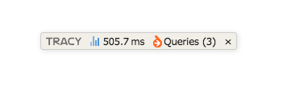
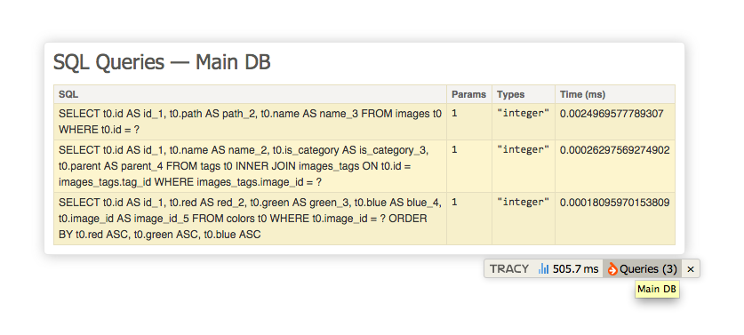

# DoctrineSql Panel for Tracy #

Add Sql requests made by Doctrine in the **Tracy** debugger bar.





## Installation ##

### Composer ###

```
composer require macfja/tracy-doctrine-sql
```

## Usage ##

Somewhere, when your application start and you initialize Doctrine

```php
use MacFJA\Tracy\DoctrineSql;
use Doctrine\ORM\EntityManager;

// ...

$entityManager = EntityManager::create($conn, $config);
DoctrineSql::init($entityManager);
```

### Multiple Manager support ###

```php
use MacFJA\Tracy\DoctrineSql;
use Doctrine\ORM\EntityManager;

// ...

$blogManager = EntityManager::create($conn1, $config2);
$configManager = EntityManager::create($conn2, $config2);
DoctrineSql::init($blogManager, 'Blog');
DoctrineSql::init($configManager, 'Config');
```

## Similar projects ##

 - [recca0120/Laravel-Tracy](https://github.com/recca0120/Laravel-Tracy) (Laravel specific - Eloquant)
 - [nextras/tracy-query-panel](https://github.com/nextras/tracy-query-panel) (Nette specific - DibiConnection, Nette\Database)
 - [Mikulas/nette-panel-queries](https://github.com/Mikulas/nette-panel-queries) (Nette specific - ElasticSearch, Neo4j)
 - [Zemistr/notorm-tracy-panel](https://github.com/Zemistr/notorm-tracy-panel) (NotORM)
